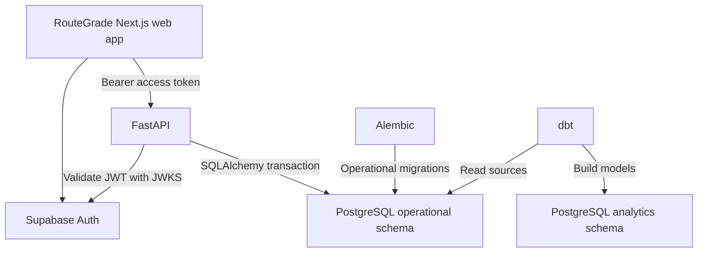

# RouteGrade MVP 2 — Authentication, API, Operational Database, and dbt

## Instructions for Claude

You are implementing MVP 2 in the existing RouteGrade repository. Treat the current repository as the source of truth. Inspect it before changing anything, preserve all working MVP 1 behaviour, and make the smallest coherent set of changes needed to satisfy this specification.

Do not replace the existing application, redesign the route experience, or perform unrelated refactors. MVP 2 adds authentication and a properly structured API/database foundation around MVP 1.

---

## 1. Objective

Add an authentication system that allows a RouteGrade user to:

1. Sign in with Google.
2. Sign in through an email magic link.
3. Remain signed in across refreshes.
4. Sign out.
5. View a basic account page.
6. Have their Supabase authentication identity stored automatically in `auth.users`.
7. Have a corresponding RouteGrade application profile stored in `public.user_profiles`.
8. Access protected FastAPI endpoints using their Supabase access token.

MVP 2 must also establish:

- A clear FastAPI application boundary.
- Transactional database access through SQLAlchemy 2.
- Version-controlled operational schema migrations through Alembic.
- A dbt project connected to PostgreSQL for analytics transformations and data-quality tests.
- A clean separation between operational data and analytical data.

The final result should demonstrate this complete flow:

```text
User signs in with Google or email
    -> Supabase Auth creates or retrieves auth.users record
    -> Next.js receives and maintains the session
    -> Next.js sends the access token to FastAPI
    -> FastAPI validates the JWT
    -> FastAPI idempotently creates or updates public.user_profiles
    -> dbt transforms non-sensitive profile data into analytics models
```

---

## 2. Non-negotiable architecture decisions

These choices have already been reviewed and approved. Do not substitute alternatives without asking first.

| Concern | Approved choice |
| --- | --- |
| Authentication | Supabase Auth |
| Authentication methods | Google OAuth and passwordless email magic link |
| Operational database | Supabase-hosted PostgreSQL |
| Primary application API | Existing FastAPI service |
| Runtime database access | SQLAlchemy 2 |
| Operational schema migrations | Alembic |
| Analytics transformation layer | dbt Core with the PostgreSQL adapter |
| Application profile provisioning | Idempotent FastAPI operation after authentication |
| Application data access | Frontend uses Supabase for authentication; application CRUD goes through FastAPI |

Important boundaries:

- dbt must **not** handle login-time inserts, API transactions, session management, or operational migrations.
- Alembic owns operational tables such as `public.user_profiles`.
- SQLAlchemy owns FastAPI runtime reads and writes.
- dbt reads operational source tables and creates models in an `analytics` schema.
- Supabase owns the managed `auth` schema. Do not modify Supabase-managed auth tables.
- The frontend must never contain the Supabase secret/service-role key, a database password, or any private key.

---

## 3. First step: inspect the repository

Before installing packages or editing code:

1. Read any `AGENTS.md`, `CLAUDE.md`, or repository-specific instructions.
2. Read the root `README.md`.
3. Inspect the repository tree.
4. Identify the current frontend framework and exact Next.js version.
5. Identify the existing FastAPI entry point and router structure.
6. Inspect existing Python and JavaScript dependency files.
7. Inspect the current environment-variable conventions.
8. Inspect existing tests, linting, formatting, and CI configuration.
9. Run the existing test and lint commands before making changes.
10. Record any existing failures separately; do not claim they were caused by MVP 2.

Expected high-level structure may resemble:

```text
apps/web/
services/api/
```

However, adapt this specification to the repository rather than forcing a duplicate structure. Reuse existing conventions and modules wherever they are sound.

After inspection, write a short implementation plan and list the files you expect to create or modify. Then implement in small, verifiable phases.

---

## 4. Scope

### 4.1 In scope

- Supabase project configuration documentation.
- Google OAuth login UI and callback handling.
- Email magic-link login UI and callback handling.
- Persistent Supabase session handling in Next.js.
- Login, logout, and account pages/components.
- Protected frontend route behaviour.
- FastAPI bearer-token authentication.
- Secure Supabase JWT verification.
- SQLAlchemy database engine and request-scoped sessions.
- `user_profiles` SQLAlchemy model.
- Alembic initialization and initial migration.
- Idempotent profile provisioning.
- Read and update endpoints for the current user.
- Strict CORS configuration.
- Backend, frontend, migration, integration, and dbt tests.
- dbt sources, staging model, user dimension, and daily signup fact.
- Documentation and local setup instructions.

### 4.2 Out of scope

Do not implement these during MVP 2:

- Email-and-password authentication.
- Password reset flows.
- Phone authentication.
- Multi-factor authentication.
- Additional OAuth providers.
- Roles beyond a normal authenticated user.
- Admin dashboards.
- Organization or team accounts.
- Paid subscriptions.
- Route ownership, saved routes, favourites, or social features.
- Account deletion automation.
- Custom email delivery infrastructure unless required to make the configured magic-link flow work.
- A separate analytics warehouse.
- dbt snapshots or incremental models unless an actual MVP 2 requirement justifies them.
- Direct frontend CRUD against `public.user_profiles`.
- Broad MVP 1 UI or architecture changes.
- Deployment, pushing, or production secret creation unless explicitly requested.

---

## 5. Target architecture



### Ownership rules

| Component | Owns |
| --- | --- |
| Supabase Auth | Identities, providers, sessions, access and refresh tokens |
| Next.js | Authentication UI, callback handling, session-aware navigation |
| FastAPI | Authorization, application validation, profile CRUD |
| SQLAlchemy | Runtime object/relational mapping and transactions |
| Alembic | Operational DDL and schema history |
| dbt | Read-only source declarations, transformations, tests, analytics documentation |

---

## 6. Dependency requirements

Reuse already-installed packages where possible. Do not introduce duplicate libraries that solve the same problem.

### 6.1 Frontend

Expected packages:

```text
@supabase/supabase-js
@supabase/ssr
```

Use the official Supabase SSR pattern appropriate to the installed Next.js version. Current Next.js projects may use `proxy.ts`; older supported versions may use `middleware.ts`. Follow the installed framework rather than blindly renaming an existing working file.

Do not install a second authentication framework such as Auth.js, Clerk, Firebase Auth, or Passport.

### 6.2 Backend

Expected responsibilities require:

```text
sqlalchemy
alembic
psycopg
pydantic-settings
PyJWT with cryptographic support, or an equivalent established JWT library already present
```

If the repository already uses an async PostgreSQL driver, keep it. Otherwise use the existing `psycopg` dependency and SQLAlchemy 2 conventions.

Do not implement JWT cryptography manually.

### 6.3 Analytics

Expected dbt packages:

```text
dbt-core
dbt-postgres
```

Keep dbt dependencies isolated from the FastAPI runtime if the repository already separates dependency groups.

---

## 7. Environment variables

Update `.env.example` files, but never add real secret values.

### 7.1 Frontend variables

```env
NEXT_PUBLIC_SUPABASE_URL=
NEXT_PUBLIC_SUPABASE_PUBLISHABLE_KEY=
NEXT_PUBLIC_API_BASE_URL=http://localhost:8000
NEXT_PUBLIC_APP_URL=http://localhost:3000
```

The Supabase publishable key is intended for client use. Do not use a secret or service-role key in any `NEXT_PUBLIC_*` variable.

### 7.2 FastAPI variables

```env
DATABASE_URL=
SUPABASE_URL=
SUPABASE_JWT_ISSUER=
SUPABASE_JWKS_URL=
SUPABASE_JWT_AUDIENCE=authenticated
CORS_ORIGINS=http://localhost:3000
```

Derived expected values:

```text
SUPABASE_JWT_ISSUER=https://<project-ref>.supabase.co/auth/v1
SUPABASE_JWKS_URL=https://<project-ref>.supabase.co/auth/v1/.well-known/jwks.json
```

Do not add the Supabase service-role key unless a requirement truly needs an administrative Supabase API operation. This MVP should not require one for normal login or profile CRUD.

### 7.3 dbt variables

Use environment variables in the local dbt profile:

```env
DBT_POSTGRES_HOST=
DBT_POSTGRES_PORT=5432
DBT_POSTGRES_USER=
DBT_POSTGRES_PASSWORD=
DBT_POSTGRES_DATABASE=postgres
DBT_POSTGRES_SCHEMA=analytics
DBT_TARGET=dev
```

Do not commit a populated `profiles.yml`. Provide a safe example or documented profile that uses `env_var()` values.

---

## 8. Required Supabase configuration documentation

Claude cannot fabricate project IDs, Google credentials, or secrets. Add a setup guide containing the exact manual actions the developer must complete.

### 8.1 Create or select the project

- Create/select the RouteGrade Supabase project.
- Record the project URL.
- Record the publishable key.
- Retrieve a direct or pooled PostgreSQL connection string appropriate to the application environment.
- Ensure the project uses asymmetric JWT signing keys where available so FastAPI can validate through JWKS.

### 8.2 Configure redirect URLs

Document both local and production placeholders:

```text
http://localhost:3000/auth/callback
https://<production-domain>/auth/callback
```

The app's Site URL and allow-listed redirect URLs must match the actual environments.

### 8.3 Configure Google OAuth

Document that the developer must:

1. Create a Google OAuth web client.
2. Add the correct JavaScript origins.
3. Add the Supabase provider callback URI supplied by the Supabase dashboard.
4. Place the Google client ID and secret in the Supabase Google-provider configuration.
5. Enable Google authentication.
6. Test both a new user and a returning user.

Google credentials belong in the provider configuration, not in frontend source code.

### 8.4 Configure email magic links

- Confirm email authentication is enabled.
- Confirm magic-link templates point to the allowed callback URL.
- Document development email-delivery limitations.
- Do not implement passwords.
- Display a neutral response after email submission so the UI does not reveal whether an account already exists.

---

## 9. Operational database design

### 9.1 Supabase-managed identity

Supabase automatically stores authenticated identities in:

```text
auth.users
```

Do not recreate or modify this table. Do not store password material anywhere in RouteGrade tables.

### 9.2 RouteGrade application profile

Create this operational table through Alembic:

```text
public.user_profiles
```

Required columns:

| Column | Type | Rules |
| --- | --- | --- |
| `user_id` | UUID | Primary key; references `auth.users(id)` with `ON DELETE CASCADE` |
| `email` | Text | Required; synchronized from verified token claims, never from request body |
| `display_name` | Text | Nullable; initialized from provider metadata when available |
| `avatar_url` | Text | Nullable; initialized from provider metadata when available |
| `auth_provider` | Text | Required; expected initial values `google` or `email` |
| `created_at` | TIMESTAMPTZ | Required; server default current timestamp |
| `updated_at` | TIMESTAMPTZ | Required; server default current timestamp; updated on changes |

Requirements:

- `user_id` is the only identity key used to authorize access.
- Do not authorize by email.
- Do not accept `user_id`, `email`, `auth_provider`, or `avatar_url` from an untrusted request body during provisioning.
- Add an index only where query behaviour justifies it. The primary key already indexes `user_id`.
- Enable Row Level Security on the table.
- Do not add browser-facing select or write policies for MVP 2 because the browser does not directly query this table.
- The trusted FastAPI database connection and dbt connection must be documented separately from browser access.

### 9.3 Migration requirements

Create an Alembic migration that:

1. Creates `public.user_profiles`.
2. Adds the foreign key to `auth.users`.
3. Adds defaults and constraints.
4. Enables RLS.
5. Has a valid downgrade that removes only MVP 2 objects.

Do not create `public.user_profiles` manually in the dashboard without an equivalent committed migration.

Do not use `dbt run-operation` as a replacement for this migration.

### 9.4 SQLAlchemy model

Create a `UserProfile` model following repository conventions.

It must:

- Use UUID values rather than strings internally.
- Use timezone-aware timestamps.
- Map explicitly to `public.user_profiles`.
- Avoid an ORM relationship to Supabase's managed `auth.users` table unless it is genuinely needed.
- Avoid exposing ORM objects directly as API responses.

Create separate Pydantic response and update models.

---

## 10. FastAPI database foundation

Implement or complete:

```text
Database settings
SQLAlchemy engine
Session factory
Request-scoped session dependency
Transaction handling
Repository/service functions
Application shutdown disposal
```

Requirements:

- Use SQLAlchemy 2 syntax.
- Do not create global mutable sessions.
- One request receives one database session dependency.
- Commit only after the complete operation succeeds.
- Roll back failed transactions.
- Do not expose raw database errors to clients.
- Log safe error context and a request/correlation ID where existing conventions support it.
- Never log connection strings, tokens, authorization headers, or full user emails.

Keep the initial implementation understandable. Do not add an elaborate generic repository framework for one table.

---

## 11. FastAPI authentication

### 11.1 Token transport

Protected requests must use:

```http
Authorization: Bearer <supabase-access-token>
```

The frontend may retrieve the raw access token from its Supabase session solely to forward it to FastAPI. FastAPI is responsible for validating it before trusting any claims.

### 11.2 JWT verification

Create a reusable FastAPI dependency such as:

```text
get_current_user_claims
```

It must:

1. Require the Bearer scheme.
2. Reject missing or malformed credentials with `401`.
3. Read the JWT header safely.
4. Select the correct public key by `kid` from the configured Supabase JWKS endpoint.
5. Verify the signature using an explicit allowed-algorithm list.
6. Validate `exp`.
7. Validate the exact configured `iss` value.
8. Validate the expected audience.
9. Require a valid UUID `sub` claim.
10. Require the authenticated role/audience expected from Supabase.
11. Return a small typed claims object, not the entire unfiltered token payload.

Cache JWKS/public keys according to library best practices so every API request does not make a network request. Support key rotation by refreshing when a `kid` is unknown. Do not write JWT signature algorithms manually.

Distinguish:

- `401 Unauthorized`: absent, expired, invalid, or unverifiable token.
- `403 Forbidden`: valid identity that is not allowed to perform an operation.

Add `WWW-Authenticate: Bearer` to authentication failures where appropriate.

### 11.3 Claims model

The typed internal claims object should contain only fields needed by the application, for example:

```text
user_id
email
role
issuer
audience
user_metadata subset
app_metadata subset
```

Provider-derived display name and avatar may be initialized from verified token metadata. Never trust client-submitted replacements for system-owned fields during provisioning.

---

## 12. User API design

Use a dedicated versioned router such as:

```text
/v1/users
```

### 12.1 `PUT /v1/users/me`

Purpose: idempotently provision the current RouteGrade profile after successful authentication.

Request:

- Bearer token required.
- No `user_id` in the request body.
- No email in the request body.

Behaviour:

1. Validate the JWT.
2. Derive `user_id`, email, provider, name, and avatar from verified claims.
3. Start a transaction.
4. Insert the profile when it does not exist.
5. If it exists, safely synchronize system-owned fields that changed.
6. Never create a second row for the same `user_id`.
7. Return the profile.

Use an atomic PostgreSQL upsert or equivalently safe transactional operation. Handle concurrent first requests without duplicate rows.

Suggested response:

```json
{
  "user": {
    "user_id": "00000000-0000-0000-0000-000000000000",
    "email": "runner@example.com",
    "display_name": "Runner",
    "avatar_url": null,
    "auth_provider": "email",
    "created_at": "2026-07-16T12:00:00Z",
    "updated_at": "2026-07-16T12:00:00Z"
  },
  "created": true
}
```

Return `201` when created and `200` when an existing profile is synchronized, if the current API response conventions support differentiating them cleanly.

### 12.2 `GET /v1/users/me`

Purpose: return the authenticated user's existing RouteGrade profile.

Requirements:

- Bearer token required.
- Read-only; do not create a missing profile inside a GET request.
- Query only by the verified token's `sub`/user ID.
- Return `404` with a clear code if provisioning has not occurred.
- Never allow a query parameter to override the current user ID.

### 12.3 `PATCH /v1/users/me`

Purpose: update user-editable application profile fields.

Initially allow only:

```json
{
  "display_name": "Nitpreet"
}
```

Requirements:

- Bearer token required.
- Reject unknown fields.
- Apply reasonable length and whitespace validation.
- Do not allow changes to `user_id`, email, auth provider, timestamps, or provider-owned avatar through this endpoint.
- Update only the authenticated user's row.
- Return the updated response model.

### 12.4 Existing health endpoint

Preserve the existing health endpoint. If a database-readiness endpoint is added, keep liveness and readiness distinct:

- Liveness should not require the database.
- Readiness may verify database connectivity with a bounded timeout.

Do not expose database version, host, credentials, or internal exception content.

---

## 13. Frontend authentication implementation

### 13.1 Supabase clients

Following the official SSR pattern for the installed Next.js version, create or adapt:

```text
Browser Supabase client
Server Supabase client
Session-refresh proxy/middleware
```

Use the publishable key. Keep browser and server client creation separate.

For protected server-rendered pages, validate identity using the supported claims/user validation method rather than trusting an unverified session user object.

### 13.2 Login page

Create a `/login` page consistent with the existing RouteGrade visual language.

It must include:

- RouteGrade branding already present in the repository.
- “Continue with Google” button.
- A visual divider.
- Email input.
- “Email me a sign-in link” button.
- Loading states that prevent duplicate submission.
- Accessible labels and keyboard behaviour.
- Neutral success message after requesting a link.
- User-friendly error message without exposing raw provider errors.
- A link back to the public route experience.

Do not redesign unrelated pages.

### 13.3 Google login

Use Supabase's Google OAuth method.

Requirements:

- Redirect to the configured `/auth/callback` route.
- Preserve a safe internal `next` destination where useful.
- Do not permit open redirects. Only allow relative paths beginning with a single `/` and reject protocol-relative or absolute destinations.
- Handle cancellation and provider errors gracefully.

### 13.4 Email magic link

Use Supabase passwordless email sign-in.

Requirements:

- Validate basic email shape client-side and rely on Supabase for authoritative handling.
- Configure the callback URL.
- Show the same neutral confirmation regardless of whether the email was previously registered.
- Do not create a separate password field.
- Prevent repeated rapid submission from the UI.

### 13.5 Callback route

Create `/auth/callback` using the official PKCE/SSR callback pattern supported by the installed packages.

Requirements:

1. Read the authorization code.
2. Exchange it for a session.
3. Reject missing or invalid codes safely.
4. Redirect to a safe internal destination.
5. Default to `/account` after successful login.
6. Redirect back to `/login` with a non-sensitive error state on failure.

### 13.6 Profile provisioning after login

After the session is established:

1. Obtain the current access token.
2. Call `PUT /v1/users/me` with the Bearer token.
3. Handle first creation and existing-user responses the same in the normal UI.
4. Do not accept a successful UI login as proof that the FastAPI profile exists until provisioning succeeds.
5. If provisioning fails transiently, show a retry action rather than silently continuing with a broken account state.

Do not send a separate user ID or email to FastAPI.

### 13.7 Account page

Create a protected `/account` page containing:

- Avatar when available.
- Display name.
- Email.
- Authentication provider.
- Account creation date where appropriate.
- Editable display name.
- Logout button.
- Link back to RouteGrade.

Do not expose raw JWTs, Supabase identifiers intended only for debugging, or provider metadata dumps.

### 13.8 Session-aware navigation

Update the existing navigation minimally:

- Signed out: show `Log in`.
- Signed in: show avatar or `Account` and `Log out`.
- The public MVP 1 route experience must remain accessible without login unless the existing product specification explicitly requires otherwise.

### 13.9 Logout

- Call Supabase sign-out.
- Clear the local session using the official client behaviour.
- Redirect to the public home page.
- Do not call a custom FastAPI logout endpoint; FastAPI does not own the Supabase session.

---

## 14. Frontend-to-FastAPI client

Create a small authenticated API client or extend the existing client.

Requirements:

- Read the configured API base URL.
- Add `Authorization: Bearer <access-token>` only for protected calls.
- Set JSON headers where appropriate.
- Do not log tokens.
- Handle `401` by prompting reauthentication or refreshing through the normal Supabase flow.
- Do not implement uncontrolled retry loops.
- Preserve typed responses.
- Keep public MVP 1 requests working.

Do not scatter raw `fetch` calls and token extraction across many components.

---

## 15. CORS and API security

Configure FastAPI CORS from environment settings.

Requirements:

- Explicitly list allowed origins.
- Do not use `*` with credentials.
- Allow only needed methods and headers.
- Include `Authorization` and `Content-Type` where needed.
- Keep local and production origins configurable.

Additional controls:

- Apply reasonable request-size limits through existing infrastructure where available.
- Validate all update payloads.
- Never use email as the authorization key.
- Never accept a client-supplied user ID for `/me` endpoints.
- Never expose the database directly through an unprotected browser path.
- Never return tokens in API response bodies.
- Never put secrets in query strings.
- Do not cache authenticated pages or `/me` responses in a way that could mix users.
- Ensure errors do not disclose whether another user's record exists.

---

## 16. dbt analytics layer

Create a dbt project inside the repository, adapting the directory to existing conventions. Preferred location when none exists:

```text
analytics/routegrade_dbt/
```

Expected structure:

```text
analytics/routegrade_dbt/
├── dbt_project.yml
├── profiles.yml.example
├── packages.yml
├── README.md
├── macros/
├── models/
│   ├── staging/
│   │   ├── _sources.yml
│   │   ├── _staging_models.yml
│   │   └── stg_user_profiles.sql
│   └── marts/
│       ├── _marts_models.yml
│       ├── dim_users.sql
│       └── fct_daily_user_signups.sql
└── tests/
```

Do not add empty directories solely to match this diagram.

### 16.1 dbt source

Declare `public.user_profiles` as a source.

The source declaration must:

- Identify the actual database and schema through target/environment conventions.
- Describe the table.
- Test `user_id` for uniqueness and non-nullness.
- Test required timestamps for non-nullness.
- Avoid source freshness configuration unless there is a real ingestion SLA; this table is transactional, not batch-ingested.

Do not expose or model the Supabase-managed `auth.users` table in dbt for MVP 2.

### 16.2 `stg_user_profiles`

Create a staging view that:

- Selects one row per `user_id`.
- Renames columns only when needed for consistency.
- Includes `user_id`, `display_name`, `auth_provider`, `created_at`, and `updated_at`.
- Explicitly excludes raw email and avatar URL from analytics.
- Does not hash email merely to retain it; omit it because it is not needed.
- Avoids business aggregation.

Tests:

- `user_id` unique.
- `user_id` not null.
- `auth_provider` accepted values for `google` and `email`, allowing an explicit controlled fallback only if provider claims require it.
- `created_at` not null.

### 16.3 `dim_users`

Create a user dimension at one row per user containing only analytics-safe fields:

```text
user_id
display_name, only if product analytics truly needs it; otherwise omit it
auth_provider
signup_at
signup_date
last_profile_updated_at
```

Prefer omitting `display_name` from the mart unless a documented analytical use exists.

Tests:

- `user_id` unique and not null.
- `signup_at` not null.
- `auth_provider` accepted values.

### 16.4 `fct_daily_user_signups`

Create an aggregate fact at this grain:

```text
one row per signup_date and auth_provider
```

Columns:

```text
signup_date
auth_provider
new_users
```

Tests:

- Composite uniqueness across `signup_date` and `auth_provider`.
- `signup_date` not null.
- `auth_provider` not null.
- `new_users` not null.
- Add a singular test that `new_users >= 0` if no existing utility package supplies it.

### 16.5 Materializations

For this small MVP:

- Staging model: view.
- `dim_users`: view or table based on existing project convention; prefer view initially.
- Daily signup fact: view initially.

Do not add incremental complexity for a tiny user table.

### 16.6 dbt commands

Document:

```bash
dbt debug
dbt compile
dbt build
dbt docs generate
```

`dbt build` must pass before MVP 2 is considered complete.

### 16.7 dbt permissions

Document the intended production permission boundary:

- dbt can read the required operational source table.
- dbt can create and replace relations in `analytics`.
- dbt does not need access to passwords, tokens, or Supabase's managed auth schema.
- The browser has no direct dbt or analytics credentials.

---

## 17. Suggested application file organization

Adapt to the repository. Do not duplicate an existing equivalent.

### 17.1 FastAPI

```text
services/api/app/
├── api/
│   └── routes/
│       └── users.py
├── auth/
│   ├── claims.py
│   ├── dependencies.py
│   └── jwks.py
├── core/
│   └── config.py
├── db/
│   ├── base.py
│   ├── session.py
│   └── models/
│       └── user_profile.py
├── repositories/
│   └── user_profiles.py
├── schemas/
│   └── users.py
└── services/
    └── users.py
```

Avoid excessive abstraction. If the existing project is flatter, keep it flatter.

### 17.2 Next.js

```text
apps/web/src/
├── app/
│   ├── login/
│   │   └── page.tsx
│   ├── auth/
│   │   └── callback/
│   │       └── route.ts
│   └── account/
│       └── page.tsx
├── components/
│   └── auth/
│       ├── GoogleSignInButton.tsx
│       ├── EmailMagicLinkForm.tsx
│       └── SignOutButton.tsx
└── lib/
    ├── api/
    │   └── authenticated-client.ts
    └── supabase/
        ├── client.ts
        ├── server.ts
        └── proxy.ts
```

Follow the casing and naming conventions already used by MVP 1.

---

## 18. Backend tests

Add focused tests that do not depend on the live production Supabase project.

### 18.1 JWT dependency tests

Test:

- Missing authorization header returns `401`.
- Wrong authentication scheme returns `401`.
- Malformed JWT returns `401`.
- Expired JWT returns `401`.
- Wrong issuer returns `401`.
- Wrong audience returns `401`.
- Unknown `kid` triggers a bounded JWKS refresh and then fails safely.
- Invalid signature returns `401`.
- Missing `sub` returns `401`.
- Non-UUID `sub` returns `401`.
- Valid signed token produces the expected typed claims.

Use generated test keys or mocked JWKS responses. Never use a production secret in tests.

### 18.2 Profile API tests

Test:

- First `PUT /v1/users/me` creates one profile.
- Repeating the same PUT does not create another row.
- Changed verified provider metadata synchronizes allowed system fields.
- Client cannot supply a different user ID.
- Client cannot supply a different email.
- `GET /v1/users/me` returns only the authenticated user's profile.
- Missing profile returns `404` on GET.
- PATCH updates display name.
- PATCH rejects system-owned fields.
- PATCH rejects an excessively long or blank display name according to chosen validation.
- User A cannot read or update user B.
- Database errors roll back the transaction.

### 18.3 Migration tests

Verify on a disposable test database or appropriate local Supabase environment:

- Upgrade creates the table and constraints.
- A duplicate `user_id` is rejected.
- Deleting the referenced auth user cascades when supported in the test environment.
- Downgrade removes only the MVP 2 profile table.
- Upgrade can be applied from a clean database.

If a plain PostgreSQL test database is used, create only the minimal `auth.users` fixture schema needed to test the migration. Do not weaken the production foreign key to make tests easier.

---

## 19. Frontend tests

Use the repository's existing test stack. Add it only if the project already has or clearly needs frontend tests; avoid replacing test frameworks.

Test:

- Login page renders both Google and email choices.
- Invalid email is rejected before submission.
- Email submission shows loading and neutral success states.
- Duplicate submissions are prevented while loading.
- Google button invokes the Google provider flow with the correct callback.
- Callback rejects missing code.
- Unsafe `next` destinations are rejected.
- Signed-out users visiting `/account` are redirected to `/login`.
- Signed-in account page renders profile data.
- Provisioning failure presents a retry action.
- Logout invokes Supabase sign-out and redirects.
- Existing MVP 1 map and route form still render.

Do not snapshot large pages unnecessarily.

---

## 20. End-to-end and manual verification

### 20.1 Automated integration flow

Where practical with a local/test Supabase environment:

1. Establish a valid test session.
2. Call the FastAPI provisioning endpoint.
3. Confirm one operational profile row exists.
4. Call GET and verify the response.
5. Update the display name.
6. Run dbt.
7. Confirm the user appears in `stg_user_profiles` and `dim_users`.
8. Confirm the signup is counted in `fct_daily_user_signups`.

### 20.2 Manual Google OAuth checklist

Google OAuth may require manual browser verification. Document and execute when credentials are available:

- New Google user can sign in.
- Returning Google user does not create a duplicate auth identity or profile.
- Avatar and display name initialize when provided.
- Redirect returns to RouteGrade.
- Refresh retains the session.
- Sign out clears the session.
- Protected account page redirects after sign out.

### 20.3 Manual email checklist

- Valid email receives a link in the configured environment.
- Link returns to the correct callback.
- First login creates the auth user and RouteGrade profile.
- Returning login reuses the same profile.
- Invalid or expired link shows a safe error and recovery path.
- Email account displays no fake avatar.

---

## 21. Documentation requirements

Update or add documentation covering:

1. Architecture overview.
2. Why dbt is not the API transaction layer.
3. Local frontend setup.
4. Local FastAPI setup.
5. Supabase project setup.
6. Google provider setup.
7. Email magic-link setup.
8. Environment variables.
9. Alembic upgrade and downgrade commands.
10. How to run API tests.
11. How to run frontend checks.
12. How to run dbt debug, compile, build, and docs.
13. Manual authentication verification.
14. Known limitations and MVP 3 follow-ups.

Include troubleshooting for:

- Redirect URL mismatch.
- CORS failure.
- Expired session.
- Invalid JWT issuer or audience.
- Empty JWKS caused by symmetric signing configuration.
- Database connection failure.
- Alembic migration permissions.
- dbt connection or schema permissions.
- Magic-link delivery delay.

---

## 22. Implementation phases

Implement in this order. Verify each phase before continuing.

### Phase 0 — Baseline and plan

- Inspect repository and instructions.
- Run existing checks.
- Document baseline failures.
- Produce file-level implementation plan.

**Small win:** The current MVP 1 baseline is understood and reproducible.

### Phase 1 — Configuration and dependencies

- Add only required dependencies.
- Add typed settings.
- Update safe `.env.example` files.
- Add Supabase setup documentation.

**Small win:** Both services start with placeholder-safe configuration and fail clearly when required settings are absent.

### Phase 2 — Operational database

- Configure SQLAlchemy sessions.
- Configure Alembic.
- Add `UserProfile` model.
- Add migration.
- Run upgrade and downgrade tests.

**Big win:** RouteGrade has its first version-controlled application table.

### Phase 3 — FastAPI authentication and user API

- Add JWKS/JWT verification.
- Add typed claims dependency.
- Add repository/service functions.
- Add PUT, GET, and PATCH `/v1/users/me` endpoints.
- Add backend tests.

**Big win:** A valid Supabase identity can securely create and retrieve exactly one RouteGrade profile.

### Phase 4 — Next.js authentication

- Add Supabase SSR clients.
- Add session refresh handling.
- Add login page.
- Add Google flow.
- Add email flow.
- Add callback route.
- Add account page and logout.

**Big win:** A user can complete login and see a persistent session in the browser.

### Phase 5 — Full-stack provisioning

- Add authenticated FastAPI client.
- Provision profile after callback/login.
- Add retry and error states.
- Verify account page reads through FastAPI.
- Confirm MVP 1 remains public and working.

**Big win:** Login creates both the Supabase identity and the RouteGrade operational profile.

### Phase 6 — dbt

- Create dbt project.
- Configure PostgreSQL profile example.
- Add source and tests.
- Add staging and mart models.
- Run `dbt build`.
- Generate dbt documentation.

**Big win:** RouteGrade can analyze signups without exposing email in analytics models.

### Phase 7 — Final QA and handoff

- Run all backend tests.
- Run frontend lint, typecheck, and tests.
- Run migration verification.
- Run `dbt build`.
- Complete manual Google and email checklists when credentials are available.
- Update README and implementation notes.
- Summarize changed files and remaining manual configuration.

**MVP 2 win:** Authentication, API authorization, operational persistence, migrations, and analytics modeling form one verified end-to-end system.

---

## 23. Acceptance criteria

MVP 2 is complete only when all applicable criteria pass.

### Authentication

- [ ] Google login works for a new user.
- [ ] Google login works for a returning user without duplicates.
- [ ] Email magic-link login works for a new user.
- [ ] Email magic-link login works for a returning user without duplicates.
- [ ] Sessions survive normal page refreshes.
- [ ] Logout clears the session.
- [ ] Invalid/expired callbacks fail safely.

### Frontend

- [ ] `/login` contains both approved login methods.
- [ ] `/account` is protected.
- [ ] Navigation reflects session state.
- [ ] Provisioning failures are visible and retryable.
- [ ] MVP 1 route/map functionality is unchanged.
- [ ] UI works at common mobile and desktop widths.

### API

- [ ] Protected endpoints require a valid Bearer token.
- [ ] JWT signature, issuer, audience, expiry, and subject are validated.
- [ ] `PUT /v1/users/me` is idempotent and concurrency-safe.
- [ ] `GET /v1/users/me` is read-only.
- [ ] PATCH permits only approved editable fields.
- [ ] No endpoint trusts a client-supplied user ID for authorization.
- [ ] Authentication errors return safe, consistent responses.

### Database

- [ ] `auth.users` contains the Supabase identity.
- [ ] `public.user_profiles` contains exactly one row per provisioned identity.
- [ ] The profile references `auth.users(id)`.
- [ ] Alembic can apply the migration cleanly.
- [ ] Alembic has a scoped downgrade.
- [ ] RLS is enabled and direct browser table access is not opened accidentally.
- [ ] No password or token is stored in the application profile.

### dbt

- [ ] dbt connects to the intended PostgreSQL environment.
- [ ] Source tests pass.
- [ ] `stg_user_profiles` contains no raw email.
- [ ] `dim_users` has one row per user.
- [ ] `fct_daily_user_signups` has the documented grain.
- [ ] `dbt build` passes.
- [ ] dbt documentation describes sources, models, columns, and grain.

### Quality and security

- [ ] Existing tests still pass or pre-existing failures are documented.
- [ ] New backend tests pass.
- [ ] Frontend lint and typecheck pass.
- [ ] No secrets are committed.
- [ ] Tokens and emails are not written to logs.
- [ ] CORS is restricted to configured origins.
- [ ] Error responses do not expose internal stack traces or database details.

---

## 24. Definition of done report

At completion, provide a concise report with:

1. Summary of the implemented flow.
2. Exact files created and modified.
3. Operational migration revision identifier.
4. API endpoints added.
5. dbt models and tests added.
6. Commands run and results.
7. Manual Supabase/Google steps still required.
8. Known limitations.
9. Recommended next step for MVP 3.

Do not say the work is complete if Google OAuth or email delivery remains untested due missing credentials. Clearly distinguish code-complete, locally verified, and externally configured states.

---

## 25. Guardrails for Claude

- Do not overwrite or delete working MVP 1 code.
- Do not introduce Auth.js, Clerk, Firebase, or another authentication provider.
- Do not replace FastAPI with Next.js API routes.
- Do not let the frontend write directly to operational profile tables.
- Do not use dbt for transactional inserts or operational migrations.
- Do not modify Supabase-managed auth tables.
- Do not put a service-role key in the browser.
- Do not trust `getSession()` user data for server-side authorization without token validation.
- Do not trust unsigned or unverified JWT claims.
- Do not authorize by email.
- Do not accept arbitrary redirect URLs.
- Do not log tokens, credentials, or full sensitive payloads.
- Do not create real secrets in committed files.
- Do not add unrelated features or refactors.
- Do not deploy, push, or alter production infrastructure without explicit approval.
- Do not weaken constraints merely to make tests pass.
- Ask before deviating from an approved architecture decision.

---

## 26. Authoritative implementation references

When framework details differ from memory, use current official documentation rather than guessing:

- Supabase Next.js server-side authentication: <https://supabase.com/docs/guides/auth/server-side/nextjs>
- Supabase Google login: <https://supabase.com/docs/guides/auth/social-login/auth-google>
- Supabase JWT verification and JWKS: <https://supabase.com/docs/guides/auth/jwts>
- dbt introduction and responsibility boundary: <https://docs.getdbt.com/docs/introduction>
- dbt PostgreSQL connection setup: <https://docs.getdbt.com/docs/core/connect-data-platform/postgres-setup>
- dbt SQL models: <https://docs.getdbt.com/docs/build/sql-models>

Use these references for behaviour, but adapt all code to the versions actually installed in RouteGrade.